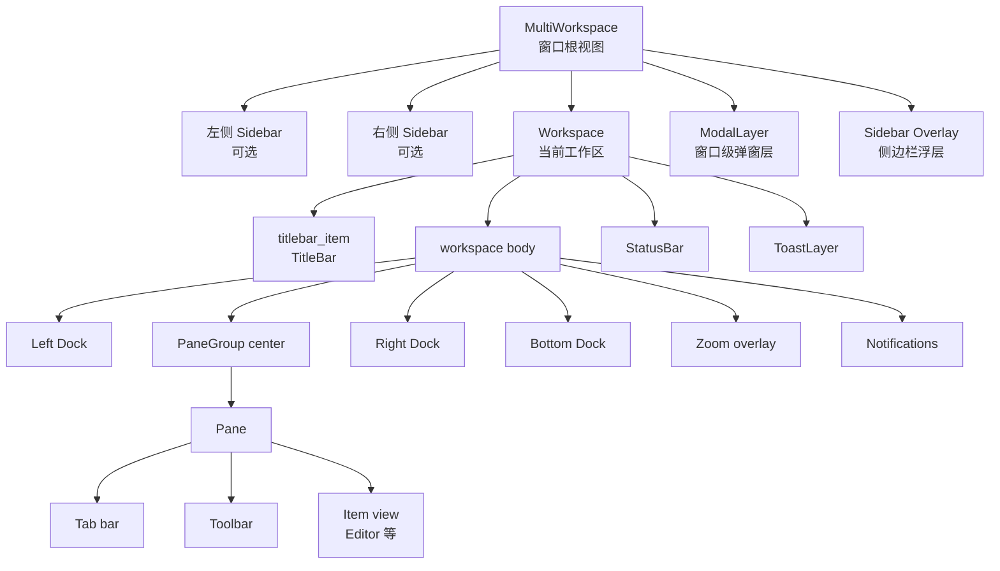

# 主界面设计与实现分析

本文梳理当前 Zed 主界面的结构、渲染路径和二次开发入口。这里的“主界面”
指一个应用窗口中的编辑工作区：标题栏、中心编辑区、左右/底部 Dock、状态栏、
侧边栏、通知、弹窗和浮层。本文只写已在当前代码中核对过的事实。

## 依据文件

主要代码依据：

- `crates/workspace/src/multi_workspace.rs`
- `crates/workspace/src/workspace.rs`
- `crates/workspace/src/dock.rs`
- `crates/workspace/src/pane_group.rs`
- `crates/workspace/src/pane.rs`
- `crates/workspace/src/status_bar.rs`
- `crates/workspace/src/toolbar.rs`
- `crates/workspace/src/item.rs`
- `crates/workspace/src/workspace_settings.rs`
- `crates/title_bar/src/title_bar.rs`
- `crates/title_bar/src/title_bar_settings.rs`
- `crates/zed/src/zed.rs`
- `crates/editor/src/editor.rs`
- `crates/editor/src/items.rs`

辅助依据：

- `docs/src/development/glossary.md`
- `docs/src/reference/all-settings.md`
- `docs/src/visual-customization.md`

没有逐个展开所有具体 Panel 的内部渲染，例如 Project Panel、Git Panel、
Terminal Panel 和 Agent Panel。本文只分析它们如何接入主界面壳层。

## 顶层结构

窗口根视图是 `MultiWorkspace`，当前激活的单个项目工作区是 `Workspace`。
`MultiWorkspace` 负责多工作区、线程/项目侧边栏、全局弹窗层和客户端窗口装饰；
`Workspace` 负责一个项目工作区内部的标题栏、中心 Pane、Dock、状态栏、通知和
Toast。

`Workspace` 源码注释给出它的定位：它收集一个窗口中与项目相关的内容，通常由
一个或多个 project、中心 pane group、三个 docks 和 status bar 组成，并作为窗口
内全局 action 的上下文。

## MultiWorkspace

`MultiWorkspace::render` 是窗口根布局。它读取当前是否启用 multi workspace、
侧边栏位置和侧边栏打开状态，然后把可选侧边栏、当前 `Workspace`、
`Workspace.modal_layer` 和侧边栏浮层组合到一个根 `h_flex` 中。

关键实现点：

- `MultiWorkspace` 的 `sidebar` 是可选的 `SidebarHandle`，只有
  `multi_workspace_enabled && sidebar_open()` 时才渲染。
- 侧边栏可以在左侧或右侧。位置来自 `sidebar_side(cx)`，最终来自 agent/sidebar
  相关设置。
- 侧边栏容器有固定宽度 `sidebar_handle.width(cx)`，旁边放一个
  `sidebar-resize-handle`。拖拽时根据鼠标位置调用 `sidebar.set_width`，双击时把
  宽度重置为 `None`。
- 根节点挂载 `ToggleWorkspaceSidebar`、`CloseWorkspaceSidebar`、
  `FocusWorkspaceSidebar`、`NextProject`、`PreviousProject`、`NextThread`、
  `PreviousThread` 等 action。
- 根布局包在 `client_side_decorations(...)` 中，并通过 `Tiling` 告诉窗口装饰层
  左/右是否被侧边栏占用。
- `Workspace` 的 `modal_layer` 在 `MultiWorkspace` 里作为子节点挂载，所以弹窗层
  盖在当前工作区上。

这意味着如果你要改“窗口外壳”或侧边栏与工作区的关系，应先看
`multi_workspace.rs`。如果只改编辑区、Dock 或状态栏，应进入 `Workspace`。

## Workspace 初始化

`Workspace::new` 创建主界面内部的核心对象：

- 创建中心 `Pane`，设置允许 split，并设置欢迎页可显示。
- 创建 `ModalLayer` 和 `ToastLayer`。
- 创建三个 `Dock`：`Left`、`Bottom`、`Right`。
- 为三个 Dock 创建 `PanelButtons`，并把它们放入状态栏。
- 创建 `StatusBar`，初始 active pane 是中心 pane。
- 创建中心 `PaneGroup`，把中心 pane 作为 root，并标记为 center。
- 注册 project、breakpoint、toolchain、窗口激活、窗口 bounds、主题外观变化等订阅。

`Workspace::new` 只把 `titlebar_item` 初始化为 `None`。标题栏由
`title_bar::init` 通过 `cx.observe_new` 监听新建的 `Workspace`，创建 `TitleBar`，
再调用 `workspace.set_titlebar_item(...)` 注入。

## Workspace 渲染树

`Workspace::render` 是主界面主体的渲染入口。它构建一个纵向根布局：

1. 根 `div` 占满窗口，使用 UI 字体和主题文本色。
2. 先渲染 `titlebar_item`。
3. 再渲染主体 `workspace` 区域。
4. 如果 `status_bar_visible(cx)` 为真，渲染 `StatusBar`。
5. 最后挂载 `ToastLayer`。

主体区域内部做了几件事：

- 放置一个全尺寸 `canvas`，记录当前 workspace bounds。bounds 变化时会对
  left/right/bottom dock 调用 `clamp_panel_size`，避免面板尺寸超过可用空间。
- 当没有 zoomed view 时，监听 `DraggedDock` 的 drag move，根据鼠标位置调整
  left/right/bottom dock 尺寸，并序列化 workspace。
- 根据 `bottom_dock_layout` 选择四种 Dock 排布。
- 追加 zoom overlay、notifications。

`Workspace` 的 focus handle 返回当前 active pane 的 focus handle。因此从外层聚焦
Workspace 时，焦点落回中心活动 Pane。

## 标题栏

标题栏在 `crates/title_bar` crate 中实现。

装配路径：

1. `title_bar::init(cx)` 初始化平台标题栏，并监听新建 `Workspace`。
2. 新建工作区时创建 `TitleBar::new("title-bar", workspace, multi_workspace, ...)`。
3. 调用 `Workspace::set_titlebar_item`，让 `Workspace::render` 渲染它。

`TitleBar::render` 的主要结构：

- 左侧区域：应用菜单、restricted mode、project host、project name、worktree/branch
  信息。
- 中间区域：collaborator list。
- 右侧区域：call controls、connection status、update version、sign in、user menu。
- 如果 `title_bar.show_menus` 为真，渲染平台标题栏和一行自定义内容。
- 如果 `title_bar.show_menus` 为假，把上述 children 直接交给 `PlatformTitleBar`。

标题栏显示项受 `TitleBarSettings` 控制，包括：

- `show_branch_status_icon`
- `show_onboarding_banner`
- `show_user_picture`
- `show_branch_name`
- `show_project_items`
- `show_sign_in`
- `show_user_menu`
- `show_menus`
- `button_layout`

如果你要在标题栏加入口，先判断它是全局窗口入口、项目信息入口、协作入口还是账户入口。
按现有结构放到左、中、右三组中，而不是在 `Workspace::render` 里直接插入。

## 中心编辑区

中心编辑区是 `PaneGroup`，不是单个编辑器。`PaneGroup` 的 root 是 `Member`：

- `Member::Pane(Entity<Pane>)`
- `Member::Axis(PaneAxis)`

split 时，`SplitDirection::Up/Down` 对应垂直 axis，
`SplitDirection::Left/Right` 对应水平 axis。`Member::new_axis` 根据方向决定旧 pane
和新 pane 的顺序。移除 pane 后，如果 axis 只剩一个 member，会折叠回那个 member。

`PaneGroup::render` 递归渲染 root。对于单个 `Pane`：

- 如果这个 pane 正是当前 zoomed view，则返回空 div，避免原位置和 overlay 重复渲染。
- 调用 `PaneLeaderDecorator` 取得协作者 leader 边框和状态盒。
- 用 `AnyView::from(pane).cached(...size_full())` 渲染 pane。
- 如果有 leader border，就叠加绝对定位边框。

`PaneAxis` 保存：

- `axis`
- `members`
- `flexes`
- `bounding_boxes`

这些状态用于 split、resize、pane 定位、查找相邻 pane 和持久化布局。

## Pane、Tab 与 Item

`Pane` 是中心编辑区的基本容器。它不只承载文本编辑器，也可以承载搜索结果、
终端、diff、图片预览或其它实现了 `Item` 的视图。

`Pane::render` 做以下事情：

- 建立 `Pane` key context，空 pane 时额外加入 `EmptyPane`。
- 让 toolbar 对 key context 贡献上下文。
- 注册 split、join、zoom、导航、切换 tab、关闭 tab、pin tab、reveal in project
  panel 等 action。
- 当 active item 存在且 tab bar 允许显示时，渲染 tab bar。
- 主内容区域：
  - 有 active item 时，渲染 pane toolbar 和 `item.to_any_view()`。
  - 没有 active item 时，渲染空占位；如果没有 visible worktree 且允许欢迎页，则创建并
    渲染 `WelcomePage`。
- 在内容上方叠加 drop target，用于拖入 tab、selection 或外部路径。
- 处理鼠标后退/前进导航键。

`Pane::render_tab_bar` 根据当前 items 生成 tab：

- 每个 tab 调用 active item 的 `tab_content`、`tab_icon`、`tab_tooltip_content`。
- 根据 diagnostics 给图标加错误或警告装饰。
- 读取 tab 相关设置：close button 位置、显示方式、preview tabs、pinned tabs 是否
  单独一行。
- 支持 tab 拖拽、drop、middle click 关闭、pin/unpin、read-only lock、context menu。
- tab bar 的右侧默认按钮包含 New、Split Pane、Zoom In/Out。

`Item` 是中心内容的核心扩展接口。`ItemHandle` 是 `Entity<T: Item>` 的对象安全包装。
`Pane` 通过 `Box<dyn ItemHandle>` 统一管理不同类型的内容。`Item` 负责提供：

- tab 文本、tab 图标、tooltip、拖拽 tab 内容。
- 是否可 split、如何 clone on split。
- dirty/save/save as/reload/read-only 状态。
- project path、project item、buffer kind。
- breadcrumbs、toolbar 显示、搜索能力、导航历史。
- 转为 serializable/followable/searchable handle。

文本编辑器不是特殊写死在 Pane 中。`Editor` 在 `crates/editor/src/items.rs` 实现
`Item for Editor`，提供 tab 标题、文件图标、Git 状态颜色、保存、reload、split、
breadcrumbs 等能力。`Editor::render` 本身只返回
`EditorElement::new(&cx.entity(), self.create_style(cx))`。

## Dock 与 Panel

Zed 的辅助区域叫 Dock，不是 Pane。当前主界面固定有三个 Dock：

- `DockPosition::Left`
- `DockPosition::Bottom`
- `DockPosition::Right`

`DockPosition::axis()` 中，left/right 是 horizontal，bottom 是 vertical。这里的 axis
用于尺寸计算：left/right 主要占宽度，bottom 主要占高度。

具体工具视图通过 `Panel` 接入 Dock。`Panel` 需要提供：

- `persistent_name`
- `panel_key`
- `position`
- `position_is_valid`
- `set_position`
- `default_size`
- `min_size`
- icon、tooltip、toggle action、activation priority
- 可选 zoom、starts_open、pane、remote id、flex width、hide button setting

`Workspace::add_panel` 会：

1. 注册 panel focus handler。
2. 根据 panel 的 `position` 找到目标 dock。
3. 读取持久化的 panel size state，兼容旧 KVP 格式。
4. 调用 `Dock::add_panel` 插入 panel。
5. 发送 `Event::PanelAdded`。

`Dock::add_panel` 会按 `activation_priority` 排序插入，注册三类订阅：

- panel 自身变化后通知 Dock 重渲染。
- settings 变化后，如果 panel 位置变化，把 panel 从旧 Dock 移到新 Dock。
- panel event：ZoomIn、ZoomOut、Activate、Close。

`Dock::render` 只渲染当前 visible panel。打开状态下，它渲染：

- `dock-panel` 容器。
- active panel 的 `AnyView`。
- 可选 resize handle。

关闭状态下，它仍保留 `dock-panel` 和 focus tracking。代码注释说明这是为了让
`toggle_panel_focus` 在 Dock 关闭时仍能找到 focus handle。

## Bottom Dock 四种布局

`Workspace::render` 根据 `WorkspaceSettings::bottom_dock_layout` 选择四种排布。
这四种布局的差异只影响 left/right/bottom Dock 和 center 的空间关系。

| 值             | 当前渲染结构                                                                                  |
| -------------- | --------------------------------------------------------------------------------------------- |
| `Full`         | 顶部一行是 left dock、center、right dock；bottom dock 占底部整行。left/right 被底部截断。     |
| `LeftAligned`  | 右侧 dock 占满高度；左侧 dock 和 center 上方一行，bottom dock 位于它们下方。left 被底部截断。 |
| `RightAligned` | 左侧 dock 占满高度；center 和右侧 dock 上方一行，bottom dock 位于它们下方。right 被底部截断。 |
| `Contained`    | left 和 right 占满高度；center 上方，bottom dock 只在 center 下方。                           |

`Workspace::render_dock` 是每个 Dock 的外层包装：

- 如果当前 zoomed view 来自该 Dock，原位置不渲染。
- 为 Dock 加 leader border。
- Dock 打开时才应用尺寸。
- left/right Dock 如果支持 flexible width，会设置 `flex_grow`、`flex_shrink` 和
  `flex_basis`。
- fixed width Dock 设置 `w(size)`，并允许在空间不足时 shrink。
- bottom Dock 设置 `h(size)`。

`Workspace::dock_size` 负责把 fixed size 或 flex 转成像素。horizontal Dock 的 flex
计算会考虑 workspace width、中心全高列数和对侧 Dock 的 fixed/flex 状态。默认
horizontal Dock flex 是 `1.0`。

## 状态栏

`StatusBar` 是底部横条，左右两侧各有一组项目。它的扩展接口是
`StatusItemView`：

- `set_active_pane_item`：active pane item 变化时更新状态。
- `hide_setting`：返回可写入 settings 的隐藏操作；没有隐藏能力时返回 `None`。

渲染时：

- 根是 `h_flex`，左右 `justify_between`。
- 背景色来自 `theme.colors().status_bar_background`。
- 在客户端窗口装饰模式下，状态栏根据窗口 tiling 和侧边栏状态调整底部圆角。
- left items 顺序渲染。
- right items 反向渲染。
- 如果 workspace sidebar 关闭，会在对应侧显示打开 sidebar 的 toggle。
- 支持右键菜单“Hide Button”，由 `HideStatusItem` 写入用户 settings。

默认装配分两部分：

- `Workspace::new` 创建三个 `PanelButtons`，左 Dock 按钮加入左侧状态栏，
  右 Dock 和底部 Dock 按钮加入右侧状态栏。
- `crates/zed/src/zed.rs` 初始化更多状态栏项，例如搜索、LSP、diagnostics、
  active file name、Git blame、merge conflict、activity、edit prediction、encoding、
  language、toolchain、line endings、Vim mode、cursor position、image info。

`PanelButtons` 读取 Dock 的 panel entries，为每个有 icon 的 panel 渲染按钮。按钮
点击时先 focus Dock，再 dispatch panel 的 toggle action。右键菜单提供移动 Dock
位置、flex/fixed width 和隐藏按钮等操作。

## Pane Toolbar

每个 `Pane` 有一个 `Toolbar`。工具栏项目实现 `ToolbarItemView`，返回
`ToolbarItemLocation`：

- `Hidden`
- `PrimaryLeft`
- `PrimaryRight`
- `Secondary`

`Toolbar::render` 在有任何非 hidden 工具项时渲染：

- 外层 `v_flex`，背景色来自 `toolbar_background`，底部分隔线来自
  `border_variant`。
- Primary left 和 primary right 放在第一行。
- Secondary items 追加在后面，按反向顺序取出。

`Toolbar::set_active_item` 会记录当前 active item，调用每个 toolbar item 的
`set_active_pane_item`，并在位置变化时通知重渲染。Pane focus 变化时，toolbar item
还可以通过 `pane_focus_update` 得到通知。

默认 toolbar item 在 `crates/zed/src/zed.rs` 的 `initialize_pane` 中加入，包括
multibuffer hint、diff toolbar、breadcrumbs、buffer search、quick action、
diagnostic controls、project search、LSP/DAP log、ACP tools、telemetry log、syntax
tree、migration banner、diff/commit/agent/image 相关 toolbar。

## 主题与视觉风格

主界面没有在一个地方硬编码完整配色。各层从主题中读取颜色：

- workspace body: `colors.background`
- editor padding: `colors.editor_background`
- panel: `colors.panel_background`
- Dock/Workspace border: `colors.border`
- status bar: `colors.status_bar_background`
- toolbar: `colors.toolbar_background`
- tab bar: `colors.tab_bar_background`
- title bar: `colors.title_bar_background` 或平台标题栏计算结果

布局主要使用 GPUI 的 `div`、`h_flex`、`v_flex`、`absolute`、`relative`、`flex_1`、
`overflow_hidden`、`cached` 等组合。主界面代码倾向于把状态挂在 Entity 上，再由
`cx.notify()` 驱动局部重渲染。

## 设置入口

主界面相关设置分散在几个 settings struct 中。

`WorkspaceSettings` 中已确认的相关字段：

- `bottom_dock_layout`
- `pane_split_direction_horizontal`
- `pane_split_direction_vertical`
- `centered_layout`
- `drop_target_size`
- `resize_all_panels_in_dock`
- `zoomed_padding`
- `window_decorations`
- `focus_follows_mouse`

`TabBarSettings`：

- `show`
- `show_nav_history_buttons`
- `show_tab_bar_buttons`
- `show_pinned_tabs_in_separate_row`

`StatusBarSettings`：

- `show`
- `show_active_file`
- `active_language_button`
- `cursor_position_button`
- `line_endings_button`
- `active_encoding_button`

`TitleBarSettings` 控制标题栏显示项和窗口按钮布局。

新增 UI 设置时，需要同时考虑：

- settings schema/default 是否已有对应字段。
- 是否需要 Settings Editor 或 docs 引用。
- 是否要在设置变化时移动/重建 UI，还是只 `cx.notify()`。
- 是否需要持久化到 workspace/session，而不是全局 settings。

## 焦点、Action 与状态传播

主界面 action 分层明显：

- `MultiWorkspace` 处理窗口级和侧边栏级 action。
- `Workspace` 注册 workspace 级 action，并把 active pane 作为默认 focus handle。
- `Dock` 有自己的 key context 和 focus handle，聚焦 Dock 时把焦点转给 active panel。
- `Pane` 注册 tab、split、close、navigation 等编辑区 action。
- `Item` 可以 relay action 到自身 focus handle。

状态传播也按容器边界走：

- active pane 改变后，状态栏通过 `StatusBar::set_active_pane` 重新监听 pane。
- active item 改变后，Pane 调用 `update_toolbar`，让 toolbar items 重新判断位置。
- Panel 发出 `PanelEvent` 后，Dock 更新 open/active/zoom 状态，并同步 Workspace 的
  zoom overlay 状态。
- Workspace bounds 变化后 clamp Dock 尺寸。
- 设置变化可能让 Panel 从一个 Dock 移到另一个 Dock。

二次开发时，不要绕开这些传播路径直接改子视图状态。优先使用现有 action、event、
settings 和 `cx.notify()` 机制。

## 持久化与恢复

主界面中有几类持久化状态：

- workspace serialization：打开的 items、pane group、dock structure、窗口 bounds 等。
- Dock panel size：`PANEL_SIZE_STATE_KEY = "dock_panel_size"`，按 workspace id/session id
  和 panel key 保存。
- Dock state：visible active panel、zoom 等由 `Dock::restore_state` 恢复。
- MultiWorkspace state：active workspace、retained workspaces、sidebar open、sidebar
  serialized state 等。
- 用户 settings：title bar、tab bar、status bar、bottom dock layout、panel dock
  位置、按钮隐藏等。

如果你新增主界面状态，先判断它属于用户偏好、workspace session、panel size state，
还是具体 Item 的 serialization。不要把临时 UI 状态写入全局 settings。

## 二次开发入口选择

按目标选择入口：

| 目标                    | 首选入口                                                                     |
| ----------------------- | ---------------------------------------------------------------------------- |
| 新增中心区域内容类型    | 实现 `workspace::Item`；如果对应文件类型，再实现/注册 `ProjectItem`。        |
| 新增左/右/底部工具面板  | 实现 `workspace::Panel`，在初始化流程中 `workspace.add_panel(...)`。         |
| 新增状态栏按钮          | 实现 `StatusItemView`，调用 `status_bar.add_left_item` 或 `add_right_item`。 |
| 新增编辑区 toolbar 控件 | 实现 `ToolbarItemView`，在 `initialize_pane` 中 `toolbar.add_item(...)`。    |
| 修改 tab 行行为         | `crates/workspace/src/pane.rs` 的 tab render 和 tab settings。               |
| 修改 Dock 布局或 resize | `Workspace::render`、`Workspace::render_dock`、`Dock::render`、`dock_size`。 |
| 修改侧边栏外壳          | `crates/workspace/src/multi_workspace.rs`。                                  |
| 修改标题栏              | `crates/title_bar/src/title_bar.rs` 和 `title_bar_settings.rs`。             |
| 修改主题色字段          | `crates/theme/src/styles/colors.rs` 及默认/fallback theme。                  |

## 风险点

- `Panel` 和 `Pane` 是不同抽象。Dock 里放 Panel，中心区放 Pane，Pane 里放 Item。
- Dock 关闭时仍在元素树中保留 focus handle。删除这个行为会影响 panel focus/toggle。
- zoomed view 通过 overlay 渲染，原位置会跳过。改布局时要保留这条路径。
- bottom dock 四种布局是手写分支，不是数据驱动布局。新增布局要同步设置、文档和测试。
- left/right flexible width 会用 center full-height column count 参与计算。改 split 布局会影响 Dock 宽度。
- 标题栏不是 Workspace 自己创建的，而是 `title_bar::init` 注入。改初始化顺序时要注意。
- 状态栏和 toolbar 都依赖 active pane/item 更新。新增项如果缓存 active item，要实现对应更新回调。
- 很多 UI 行为通过 action dispatch，而不是直接调用具体方法。新增交互时优先复用 action。

## 建议验证

主界面改动后，至少按改动范围做这些验证：

- `cargo check -p workspace` 或目标 crate 的 `cargo check`。
- 涉及具体 Panel 时，跑对应 panel crate 的测试。
- 涉及 GPUI 交互时，补或运行相关 `gpui::test`。
- 手动启动 Zed，检查：
  - 打开/关闭 left/right/bottom dock。
  - 拖拽调整 dock 和 sidebar 宽度。
  - 四种 bottom dock layout。
  - 分屏、关闭 pane、zoom in/out。
  - tab pin、close、preview、拖拽。
  - 状态栏按钮右键隐藏。
  - title bar 在 `show_menus` 开/关时的表现。

如果只新增一个状态栏或 toolbar 项，不需要全量测试所有主界面功能；但要覆盖 active
item 变化、隐藏设置和焦点切换。
