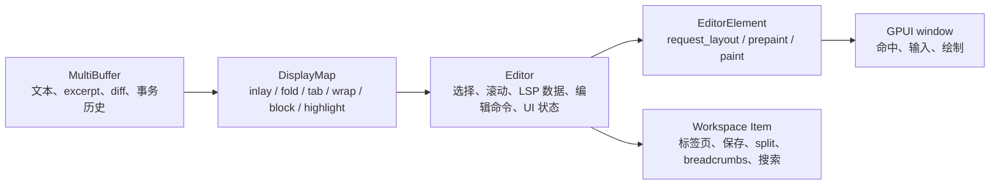

# 主编辑器设计与实现分析

本文分析当前 Zed 主编辑器的核心设计与实现。这里的“主编辑器”指
`crates/editor` 中的 `Editor`、`EditorElement`、`DisplayMap`、
`MultiBuffer` 接入和它们在 workspace `Item` 体系中的表现，不包含整个窗口壳层。
窗口、Dock、Pane、状态栏和标题栏见
[主界面设计与实现分析](./11-main-interface-design-and-implementation.md)。

## 依据文件

主要代码依据：

- `crates/editor/src/editor.rs`
- `crates/editor/src/element.rs`
- `crates/editor/src/display_map.rs`
- `crates/editor/src/input.rs`
- `crates/editor/src/items.rs`
- `crates/multi_buffer/src/multi_buffer.rs`

关联代码依据：

- `crates/workspace/src/item.rs`
- `crates/workspace/src/pane.rs`
- `crates/project/src/project.rs`
- `crates/language/src/language.rs`

本文没有展开 `element.rs` 中每个 `layout_*`、`paint_*` helper 的内部实现，也没有逐个
审计所有语言服务、调试器、Git、协作和 AI 入口。文中只把已核对的结构和调用路径写成
确定结论。

## 总体结构

主编辑器不是单一文本控件，而是一组状态模型、显示模型和 GPUI 元素生命周期的组合。
核心路径是：



边界可以这样理解：

- `MultiBuffer` 管文本和多 buffer/excerpt 视图，包含 dirty、diff、事务历史和底层
  `Buffer` 集合。
- `DisplayMap` 管“文本如何成为显示文本”，例如 inlay hint、折叠、tab 展开、软换行、
  自定义 block 和高亮。
- `Editor` 管编辑器实体状态，例如选择、滚动、模式、LSP 数据、补全、诊断、gutter、
  协作光标、Git blame、minimap、持久化和异步任务。
- `EditorElement` 管 GPUI 元素生命周期，将 `EditorSnapshot` 变成可布局、可命中、可
  绘制的像素结果。
- `items.rs` 让 `Editor` 成为 workspace 中的 `Item`，从而能进入 pane、tab、保存、
  reload、split、breadcrumbs 和搜索体系。

## Editor 模式

`EditorMode` 决定编辑器的尺寸策略、功能开关和输入能力：

| 模式         | 用途                   | 关键行为                                                              |
| ------------ | ---------------------- | --------------------------------------------------------------------- |
| `SingleLine` | 单行输入场景           | 使用 UI 字体，强制不软换行，不显示完整 gutter。                       |
| `AutoHeight` | 高度随内容变化的编辑器 | 通过 measured layout 计算高度，可设置最小/最大行数。                  |
| `Full`       | 常规文件编辑器         | 启用完整编辑体验、gutter、LSP 数据、代码镜头、runnables、minimap 等。 |
| `Minimap`    | 父编辑器的缩略视图     | 复用/关联显示数据，禁用输入，设为只读，不注册完整焦点处理。           |

`EditorMode::full()` 默认启用 buffer 字体缩放、活动行背景和默认尺寸策略。很多功能在
`new_internal` 中通过 `full_mode` 控制，非 Full 模式不会默认启用诊断、LSP 数据、代码
镜头、runnables、word completions 等重型能力。

## Editor 状态模型

`Editor` 是一个大的 GPUI `Entity` 状态对象。它不只保存文本，还集中管理编辑器会话里的
大量横切状态。源码中的字段可以分成几类：

- 焦点和输入：`focus_handle`、`last_focused_descendant`、`input_enabled`、
  `expects_character_input`、`use_modal_editing`、`read_only`。
- 文本模型：`buffer: Entity<MultiBuffer>`。
- 显示模型：`display_map: Entity<DisplayMap>` 和可选
  `placeholder_display_map`。
- 选择与滚动：`SelectionsCollection`、`ScrollManager`、选择历史、延迟选择副作用、
  columnar/add/select-next 状态、snippet 栈和 autoclose 区域。
- 诊断、语言服务和智能能力：诊断等级、内联诊断、语义 token、补全/语义 provider、
  inlay hints、document symbols、document links、code lens、runnables。
- UI 开关：gutter、行号、相对行号、Git diff gutter、code actions、bookmarks、
  breakpoints、wrap guides、indent guides、minimap、光标形状、当前行高亮。
- 协作显示：collaboration hub、leader/remote id、本地和远程选择、光标名称。
- 浮层和辅助功能：补全菜单、hover、signature help、context menu、edit prediction、
  Git blame、diff review、debugger、bookmarks、breakpoints。
- 渲染缓存：`style`、`text_style_refinement`、`last_bounds`、
  `last_position_map`、`gutter_dimensions`、上次右边距和水平滚动条可见性。
- 持久化：buffer 序列化、选择序列化、fold 序列化。
- 扩展点：`addons: TypeIdHashMap<Box<dyn Addon>>`。

这说明 `Editor` 是编辑会话的协调者。二次开发时，如果改动会影响选择、滚动、事务、
智能能力或视图状态，通常先从 `editor.rs` 找入口，而不是直接改 `element.rs`。

## 创建流程

`Editor::new` 委托给 `Editor::new_internal`。构造过程做了几件关键工作：

1. 校验显式传入 `DisplayMap` 只用于 minimap。
2. 根据模式计算 `full_mode`、`is_minimap` 和诊断最大等级。
3. 从窗口文本样式取字体和字号。
4. 创建折叠占位元素。占位显示 `⋯`，点击后调用 `unfold_ranges`。
5. 创建 `DisplayMap::new(...)`，传入 `MultiBuffer`、字体、字号、文件头高度、
   excerpt 头高度、折叠占位和诊断等级。
6. 创建 `SelectionsCollection` 和 `BlinkManager`。minimap 会禁用 blink。
7. `SingleLine` 设置 `soft_wrap_mode_override` 为不换行。
8. Full 模式且有 `Project` 时，订阅 project 事件，用于刷新 code lens、inlay hints、
   semantic tokens、runnables、LSP 数据、隐藏 buffer 事务等。
9. 非 minimap 注册焦点、焦点进入/离开、blur 和 pending input 观察。
10. 根据模式初始化 gutter、scrollbar、line numbers、LSP、diagnostics、word
    completions、read-only、serialization 等字段。
11. 订阅 `MultiBuffer`、`DisplayMap`、blink、settings、theme、buffer 字体变化和窗口激活。
12. Full 模式继续初始化 sticky headers、Git blame inline、active debug line、minimap、
    LSP colors、inlay hints、code lens、singleton buffer 注册和打开事件上报。

构造逻辑强调一个边界：minimap 是 `Editor`，但它不是完整编辑器。它只读、禁用输入，
也会跳过很多焦点、LSP 和项目能力初始化。

## MultiBuffer

`MultiBuffer` 是编辑器持有的文本视图。它可以是 singleton，也可以由多个 buffer/excerpt
组成。字段里包含：

- 当前 `MultiBufferSnapshot`。
- 底层 `BufferState` 集合。
- buffer 对应 diff 状态。
- 订阅 topic。
- singleton 标记。
- 事务历史。
- title、capability、dirty/sync 标记。

`snapshot(cx)` 和 `read(cx)` 都会先 `sync(cx)`，再返回当前快照或快照引用。编辑入口是
`edit` 和 `edit_non_coalesce`，两者都进入 `edit_internal`：

- 如果只读或没有 buffer，直接返回。
- 先 `sync_mut(cx)`。
- 把传入范围转换成 `MultiBufferOffset`。
- 规范化反向 range。
- 再进入非泛型的内部编辑实现，避免泛型路径膨胀。

对主编辑器来说，`MultiBuffer` 提供的是可事务化的文本事实源。显示层和输入层都不应该
绕开它直接修改底层 buffer。

## DisplayMap

`DisplayMap` 的源码注释明确说明：它不负责像素布局，布局和绘制属于
`EditorElement`。`DisplayMap` 负责决定文本在显示坐标里如何出现。

层级从底向上是：

1. `InlayMap`：插入 inlay 和 inlay hint。
2. `FoldMap`：管理折叠区域和折叠占位。
3. `TabMap`：处理硬 tab。
4. `WrapMap`：处理软换行。
5. `BlockMap`：处理诊断等自定义 block。
6. `DisplayMap`：在上述结果上叠加文字、inlay 和语义 token 高亮。

每层都有自己的坐标 newtype、snapshot、transform 和 `sync`。`sync` 接收下层坐标空间的
失效范围，输出本层坐标空间的失效范围。这样可以避免每次编辑都重算整篇文本。

`DisplayMap::new` 有一个容易忽略的约束：它先获取 `MultiBuffer` snapshot，再创建 buffer
subscription。源码注释说明，`snapshot()` 可能触发 `sync()` 并发布 edits；如果先订阅，
新建的 `InlayMap` 可能已经处于编辑后的状态，却又捕获到同一批 edits，导致不同步。

`DisplayMap::snapshot` 会：

- 同步到 wrap 层。
- 如果存在 companion display map，一起同步对侧 wrap 数据。
- 读取 `BlockMap`，生成 `BlockSnapshot`。
- 生成可选 companion snapshot。
- 返回 `DisplaySnapshot`，其中包含 block snapshot、crease snapshot、各类高亮、mask、
  诊断等级、折叠占位和是否使用 LSP folding ranges。

`DisplaySnapshot` 提供向下访问：

- `wrap_snapshot()`
- `tab_snapshot()`
- `fold_snapshot()`
- `inlay_snapshot()`
- `buffer_snapshot()`

`DisplayPoint` 是最终显示坐标。它的 `to_offset` 会按
`block -> wrap -> tab -> fold -> inlay -> buffer` 的顺序映射回
`MultiBufferOffset`。`DisplayPointConverter` 则把 buffer offset range 映射为
`DisplayPoint` range，并复用前向 cursor；如果输入 range 倒退，会 reset cursor 保证正确。

二次开发时，所有跨坐标空间的逻辑都应使用这些 API。直接把 buffer 行列当 display 行列
使用，会在 inlay、fold、tab、wrap 或 block 存在时出错。

## EditorSnapshot

`Editor::snapshot(window, cx)` 把当前 `Editor` 可渲染状态打包成 `EditorSnapshot`。
快照里包含：

- 当前 `EditorMode`。
- gutter、line numbers、Git diff、code actions、runnables、breakpoints、bookmarks 等开关。
- `DisplaySnapshot` 和可选 placeholder display snapshot。
- focus 状态。
- 滚动 anchor 和进行中的滚动状态。
- 当前行高亮、gutter hover、语义 token 开关等。

`EditorElement` 的布局和绘制主要消费 `EditorSnapshot`，而不是在绘制过程中随意读取和变更
所有 `Editor` 字段。这样可以把“当前一帧看到的编辑器状态”固定下来，再根据它做布局。

## 选择副作用和历史

选择变化不是简单替换一个 range。`SelectionEffects` 定义了选择变化后的副作用：

- 是否写入导航历史。
- 是否重新触发补全。
- 是否滚动到可见区域。
- 是否来自搜索。

默认行为会在光标移动超过一定行数时写导航历史、重新触发补全，并滚动到合适位置。
`no_scroll`、`scroll`、`completions`、`nav_history`、`from_search` 等方法用于调节这些
副作用。

`SelectionHistory` 按事务保存 undo/redo 前后的选择。`undo` 会从事务记录恢复开始选择，
`redo` 会恢复结束选择。如果没有记录，会记录错误日志，因为这会造成 undo 后光标位置不对。

这解释了为什么文本修改必须走 `Editor::transact`：它不只修改文本，还要维护选择历史和
编辑事件。

## GPUI 渲染入口

`impl Render for Editor` 很短：它返回
`EditorElement::new(&cx.entity(), self.create_style(cx))`。也就是说，真正的元素生命周期在
`element.rs`。

`Editor::create_style` 根据模式选择字体和背景：

- `SingleLine` 和 `AutoHeight` 使用 UI 字体、较小字号和透明背景。
- `Full` 和 `Minimap` 使用 buffer 字体和 buffer 字号。
- `Full` 使用 editor 背景。
- `Minimap` 使用带透明度的 editor 背景。
- 样式还包含 border、local player、syntax theme、status colors、inlay hint 样式、
  edit prediction 样式、unnecessary code fade 和是否显示下划线。

`EditorElement` 本身只有三个字段：

- `editor: Entity<Editor>`
- `style: EditorStyle`
- `split_side: Option<SplitSide>`

它同时负责注册大量 editor action，包括移动、选择、滚动、复制、snippet tabstop、上下文
菜单等。`paint` 阶段还会注册 key listener 和输入处理器；minimap 不注册这些完整输入路径。

## request_layout

`EditorElement::request_layout` 先把样式写回 `Editor`，再按模式请求 GPUI layout：

- `SingleLine`：宽度占满父容器，高度等于文本行高。
- `AutoHeight`：使用 measured layout，回调 `compute_auto_height_layout`。
- `Minimap`：宽高都占满父容器。
- `Full`：宽度占满父容器。默认高度占满父容器；如果 sizing behavior 是
  `SizeByContent`，根据最大显示行数和行高计算内容高度。

`compute_auto_height_layout` 会在已知宽度下计算 gutter、文本宽度、wrap width，必要时更新
wrap，再用 `snapshot.max_point().row()` 计算滚动高度，并用 `min_lines` 和 `max_lines`
夹住最终高度。

## prepaint

`prepaint` 是主编辑器最重的阶段。它把快照、字体指标、滚动位置、可见行、gutter、block、
选择、浮层和滚动条全部排好，返回 `EditorLayout`。

关键步骤如下：

1. 用 `EditorRequestLayoutState` 增加 prepaint depth。最大深度是 5，用于限制 block 高度
   或 renderer 宽度变化造成的递归 prepaint。
2. 非 minimap 时，把窗口 view id 和 focus handle 指向当前 editor。
3. 读取 `EditorSnapshot` 和只读状态。
4. 计算字体、字号、行高、em 宽度、glyph grid cell。
5. 计算 gutter 尺寸、文本区宽度、垂直滚动条宽度、minimap 宽度、右侧边距和 editor 内容宽度。
6. 写回 `last_bounds`、`gutter_dimensions`、可见行数、可见列数。非 AutoHeight/Minimap 时，
   根据软换行设置计算 wrap width，并在变化时重新取 snapshot。
7. 插入 editor、gutter、text hitbox。
8. 根据父级 content mask 裁剪可见区域，只对实际可见的 display row 调用 `row_infos`。
   这对大文件和列表内嵌编辑器很重要。
9. 将可见 display row 转为 buffer anchor 范围，用于选区、高亮、诊断、gutter 等查询。
10. 计算 diff hunk 背景、拖拽高亮、gutter 高亮、document colors、redacted ranges。
11. 收集可见选择、选中 buffer id 和每个 buffer 的最新选择 anchor。
12. 计算 selection layout、活动行、run indicator、breakpoint、line numbers、展开按钮、
    crease toggle/trailer 和 gutter diff hunks。
13. 调用 `layout_lines` 生成每行文本布局，并从元素 fragment 中收集 renderer width。
    如果 renderer width 变化且 depth 还允许，会更新宽度后递归 prepaint。
14. 计算最长行宽度和 scrollbar layout 需要的文档尺寸。
15. 计算 sticky buffer header、indent guides、custom blocks。block 尺寸变化时，如果 depth
    还允许，会调用 `resize_blocks` 后递归 prepaint。
16. 处理水平/垂直 autoscroll，计算最终 scroll pixel position。
17. 计算 sticky scroll headers、inline diagnostics、inline code actions、inline blame。
    inline blame 会覆盖同一行的 inline diagnostics。
18. 预排文本行、spacer blocks、non-spacer blocks、可见光标、导航 overlay、scrollbars。
19. 计算 gutter 菜单、run indicators、bookmarks、breakpoints、diff review button、
    signature help、hover popovers、blame popover 和鼠标上下文菜单。
20. 计算 wrap guides、minimap、不可见字符形状、diff hunk controls。
21. 创建 `PositionMap`，并写回 `editor.last_position_map`、`last_right_margin` 和
    `last_horizontal_scrollbar_visible`。
22. 返回 `EditorLayout`。

`EditorLayout` 是一帧绘制所需数据的集合，包含 position map、hitbox、scrollbars、minimap、
可见行范围、活动行、高亮、文本行元素、行号、diff hunks、inline diagnostics、inline
blame、blocks、选区、光标、bookmarks、breakpoints、sticky headers、document colors 等。

## paint

`paint` 消费 `EditorLayout`，按顺序完成事件注册和实际绘制：

1. 非 minimap 时设置 key context，注册 `ElementInputHandler`，注册 action 和 key listener。
2. 设置 rem size、文本样式和 content mask。
3. 注册鼠标监听。
4. 为 sticky headers 下方建立 mask，避免透明背景下内容穿透。
5. 绘制背景。
6. 绘制 indent guides。
7. 如果 gutter 有宽度，绘制 Git blame 行和行号。
8. 绘制文本。
9. 绘制 spacer blocks。
10. 绘制 gutter highlights 和 gutter indicators。
11. 绘制 non-spacer blocks。
12. 绘制 sticky buffer header。
13. 绘制 sticky headers。
14. 绘制 minimap。
15. 绘制 scrollbars。
16. 绘制 edit prediction popover。
17. 绘制鼠标上下文菜单。

这个顺序体现了层级关系：背景和缩进线在底层，文本在中间，block、gutter 指示、sticky、
minimap、scrollbar 和 popover 在上层。

## PositionMap 和命中

`PositionMap` 保存像素坐标和 display 坐标之间的映射上下文：

- editor 尺寸。
- 滚动位置和像素滚动位置。
- 最大滚动范围。
- em advance 和 em layout width。
- 可见 display row 范围。
- 每行 `LineWithInvisibles`。
- `EditorSnapshot`。
- 文本对齐和内容宽度。
- text/gutter hitbox。
- inline blame bounds、display hunks 和 diff hunk control bounds。

`point_for_position` 会：

1. 把鼠标像素位置转成相对 text hitbox 的位置。
2. 加上水平滚动，计算目标 display row。
3. 在对应行的 `LineWithInvisibles` 中按 x 坐标找列。
4. 如果点在行尾之后，记录 overshoot。
5. 通过 `DisplaySnapshot::clip_point` 得到左/右 bias 下的合法点。
6. 根据 inlay bias 决定最近合法点。

因此，鼠标命中、拖拽选区、上下文菜单和 gutter 操作都依赖上一帧的
`last_position_map`。如果你新增会影响布局的显示元素，需要保证它参与 line/block 布局，
否则 hit testing 会和屏幕显示不一致。

## 输入和编辑事务

字符输入入口在 `input.rs`。

`replay_insert_event` 做两件事：

- 如果 `input_enabled` 为 false，发出 `InputIgnored` 事件并返回。
- 否则发出 `InputHandled` 事件；如果输入法传入相对 UTF-16 替换范围，先把当前选择改为
  替换范围，再调用 `handle_input`。

`handle_input` 的核心流程是：

1. 只读时返回。
2. 展开含有选择的折叠 buffer。
3. 从当前 `DisplaySnapshot` 取调整后的选择。
4. 针对每个选择检查 head/tail 所在 buffer 是否可编辑。
5. 处理括号自动闭合、auto surround、linked edit、autoclose region 和相邻编辑。
6. 生成 `edits` 和新的 anchor selection。
7. 如果所有选择都不可写，返回。
8. 进入 `Editor::transact`。
9. 事务内调用 `MultiBuffer::edit` 或 `edit_non_coalesce`。
10. 应用 linked edits。
11. 用新的 `DisplayMap` snapshot 解析 selection，更新 autoclose region。
12. 调用 `change_selections`，通常请求滚动到光标位置但不立即触发补全。
13. 触发 on-type formatting、signature help、hard wrap rewrap、completion、linked range
    刷新和 edit prediction 刷新。

`Editor::transact` 会包住：

- `start_transaction_at`
- 用户传入的更新闭包
- `end_transaction_at`

开始事务时，编辑器会结束当前 selection，调用 `MultiBuffer::start_transaction_at`，并把当前
selection 写入 `SelectionHistory`。结束事务时，编辑器调用 `MultiBuffer::end_transaction_at`，
写入结束 selection，并发出 `EditorEvent::Edited`。

`undo` 和 `redo` 也走 `MultiBuffer`，再用 `SelectionHistory` 恢复选择，刷新滚动、取消标记、
刷新 edit prediction，并发出编辑事件。不要绕开这条路径直接改 buffer，否则 undo/redo、
光标恢复和编辑事件都会不完整。

## Action 和键盘事件

`EditorElement::register_actions` 在 paint 阶段为 editor 注册大量 action。已核对的类别包括：

- 光标移动和选择扩展。
- 按行、半页、整页滚动。
- 跳到文件、段落、excerpt 起止位置。
- 选择全部、选择行、多光标和匹配选择。
- 复制、裁剪复制、与剪贴板 diff。
- snippet tabstop。
- 上下文菜单、Git blame hover 等。

`register_key_listeners` 监听 modifier 变化：

- 如果 inlay hint 设置要求按住 modifier 显示/隐藏，会触发 inlay hint 刷新。
- 如果 hover 状态已经获得焦点，则不继续处理 editor modifier 行为。
- 否则调用 `handle_modifiers_changed`，并使用当前 layout 的 `PositionMap`。

这意味着某些看似纯键盘的行为仍可能依赖当前布局和命中信息。

## Workspace Item 集成

`items.rs` 中的 `impl Item for Editor` 把编辑器接入主界面。

主要能力包括：

- `act_as_type`：编辑器可作为 `Editor`，也可暴露内部 `MultiBuffer`。
- `navigate`：接受 `NavigationData`，恢复 scroll anchor 和光标位置。
- `tab_tooltip_text`：singleton 文件显示绝对路径；否则显示 multi-buffer title。
- `tab_content_text` 和 `suggested_filename`：用于 tab 文本和建议文件名。
- `tab_icon`：按文件路径和图标设置取文件图标。
- `tab_content`：渲染 tab label，支持 Git 状态颜色、路径描述、预览斜体和已删除文件删除线。
- `for_each_project_item`：遍历内部所有 buffer，暴露给项目 item 体系。
- `buffer_kind`：区分 singleton 和 multibuffer。
- `active_project_path`：返回活动 buffer 的 project path。
- `can_save_as`：只有 singleton 可以另存为。
- `can_split` 和 `clone_on_split`：支持 split，并通过 `self.clone(window, cx)` 创建分屏副本。
- `set_nav_history`、`deactivated`、`workspace_deactivated`：接入导航历史和 hover 清理。
- `is_dirty`、`capability`、`toggle_read_only`、`has_deleted_file`、`has_conflict`。
- `can_save`、`save`、`save_as`、`reload`：接入 project 保存、格式化保存、另存和 reload。
- `as_searchable`：把 editor 作为 searchable item。
- `pixel_position_of_cursor`：提供最新光标像素位置。
- `breadcrumb_location`、`breadcrumbs`、`breadcrumb_prefix`：singleton editor 在 toolbar primary
  left 显示 breadcrumbs；非 singleton 的 breadcrumbs 显示在 multibuffer 的 sticky file
  headers 上。

因此，改标签页标题、保存行为、split、breadcrumbs 或搜索接入时，应先读 `items.rs`，而
不是只看 `editor.rs`。

## 智能能力和项目事件

Full 模式下，`Editor` 会把 `Project` 作为 completion、semantics、collaboration 和 code
action provider 的来源。构造期间订阅的 project 事件会触发：

- 刷新 code lens。
- 刷新 inlay hints。
- 刷新 semantic tokens。
- language server 移除后清理已注册 buffer、重新注册可见 buffer、刷新 runnables、LSP 数据
  和 inlay hints。
- snippet edit 时在当前 focused singleton buffer 插入 snippet。
- entry rename 和 workspace edit 时，为隐藏 buffer 打开事务。
- task inventory 变化时刷新 runnables。
- breakpoint store 事件时清理/定位 debug line 并刷新 inline values。
- Git repository added 时加载 buffer 的未提交 diff。

这些能力不是 `EditorElement` 的职责。`element.rs` 只消费已经存在的行内诊断、code action、
blame、runnable、breakpoint 等状态并把它们排版/绘制出来。

## Minimap

Minimap 使用 `EditorMode::Minimap { parent }`，但仍然是一个 `Editor`。

已确认的特殊点：

- 创建时允许传入 display map。
- `BlinkManager` 被禁用。
- 不注册完整焦点和 pending input 观察。
- `input_enabled` 和 `expects_character_input` 为 false。
- `read_only` 为 true。
- `searchable` 为 false。
- `buffer_serialization` 不启用。
- 构造函数在基础字段初始化后直接返回，不继续执行 Full 模式的项目/LSP/minimap 初始化。
- `paint` 中 minimap 不注册 key context、输入 handler、action 和 key listener。

所以 minimap 可复用编辑器显示能力，但不能按完整 editor 扩展。新增编辑器功能时要检查它
是否应该在 minimap 中关闭。

## 自定义 block 和递归布局

`DisplayMap` 的 `BlockMap` 负责在显示文本中插入自定义 block。`EditorElement::prepaint`
会调用 `render_blocks`、`layout_blocks`、`paint_spacer_blocks` 和
`paint_non_spacer_blocks`。

block 可能影响行高、滚动范围和可见区域。实现中有两类会触发重新 prepaint 的情况：

- renderer width 变化：`update_renderer_widths` 返回 true。
- block 尺寸变化：`resize_blocks` 需要写回新尺寸。

这两类都受 `EditorRequestLayoutState::MAX_PREPAINT_DEPTH` 限制。当前上限是 5。超过上限时，
block resize 会被丢弃并触发 debug panic。二次开发新增 block 时，应让 block 尺寸稳定，
避免每帧持续改变可用宽高。

## 可见范围和性能

主编辑器不会对整个文件做完整像素布局。`prepaint` 根据 editor bounds 和父级
`ContentMask` 计算：

- `visible_top`
- `visible_bottom`
- `clipped_top`
- `visible_height`
- `start_row`
- `end_row`

然后只对 `start_row..end_row` 取 `row_infos` 和做多数 layout。对于内容高度很大的 editor
嵌入列表的场景，父级裁剪会减少实际渲染行数。

如果新增功能需要按行渲染，优先把逻辑限制在可见 display row 范围内。需要全文件分析的
能力应放在后台任务或 snapshot/索引层，不要在 `prepaint` 中扫描整个 buffer。

## 设置和主题来源

已核对的路径中，主编辑器会读取多类设置和主题：

- `EditorSettings`：scrollbar、minimap、sticky scroll、cursor、diagnostics、code lens、
  auto signature help 等。
- `ProjectSettings`：诊断 inline、Git inline blame、session restore 等。
- `AllLanguageSettings` 和 per-language settings：inlay hints、whitespace map、autoclose、
  autosurround 等。
- `ItemSettings`：tab 文件图标、Git 状态显示。
- `TabBarSettings`：tab bar 隐藏时 breadcrumb 前缀图标。
- `ThemeSettings`、当前 theme syntax/status/colors：字体、语法样式、诊断颜色、diff 背景、
  invisible 字符颜色等。

改默认视觉或行为时，不要只在渲染处硬编码。先确认是否已有设置路径和 theme token。

## 二次开发入口

按目标改动选择入口：

| 目标                                                   | 优先阅读/修改                                                             |
| ------------------------------------------------------ | ------------------------------------------------------------------------- |
| 修改编辑命令、选择、滚动、事务                         | `crates/editor/src/editor.rs`                                             |
| 修改字符输入、括号闭合、linked edit、输入法替换        | `crates/editor/src/input.rs`                                              |
| 修改 inlay、fold、tab、wrap、显示坐标、虚拟 block      | `crates/editor/src/display_map.rs` 及其子模块                             |
| 修改像素布局、gutter、光标、选区、滚动条、minimap 绘制 | `crates/editor/src/element.rs`                                            |
| 修改 tab、保存、split、breadcrumbs、搜索接入           | `crates/editor/src/items.rs`                                              |
| 修改底层多 buffer、excerpt、diff、事务历史             | `crates/multi_buffer/src/multi_buffer.rs`                                 |
| 修改项目/LSP 数据来源                                  | `crates/project/src/project.rs` 和 editor 中的 provider/subscription 入口 |

常见注意点：

- 不要绕过 `Editor::transact` 直接改文本。
- 不要把 buffer 坐标当 display 坐标使用。
- 不要在 `prepaint` 中做全文件扫描。
- 不要假设 Full editor 的能力在 minimap、single-line 或 auto-height 中可用。
- 新增 block 要考虑尺寸收敛和 prepaint depth。
- 改 action 时同时检查 key context、输入 handler 和 workspace item 行为。
- 改保存或 dirty 状态时检查 `MultiBuffer`、`Project` 和 `Item` 三侧契约。

## 复核建议

继续深入某个功能时，建议从这些搜索点开始：

```sh
rg "fn layout_.*diagnostic|inline_diagnostics" crates/editor/src
rg "BlockProperties|RenderBlock|BlockPlacement" crates/editor/src
rg "change_selections|SelectionEffects" crates/editor/src
rg "start_transaction_at|end_transaction_at" crates/editor/src crates/multi_buffer/src
rg "impl Item for Editor" crates/editor/src/items.rs
```

仓库存在 `.codegraph/` 时，按项目规则应先用 CodeGraph 定位符号和调用路径，再用 `rg` 和
源码阅读补充细节。
