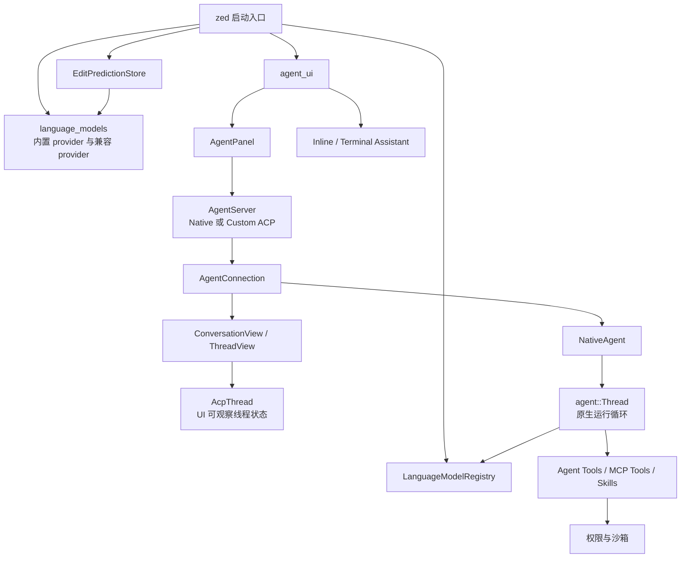
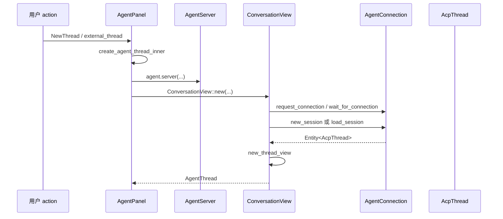
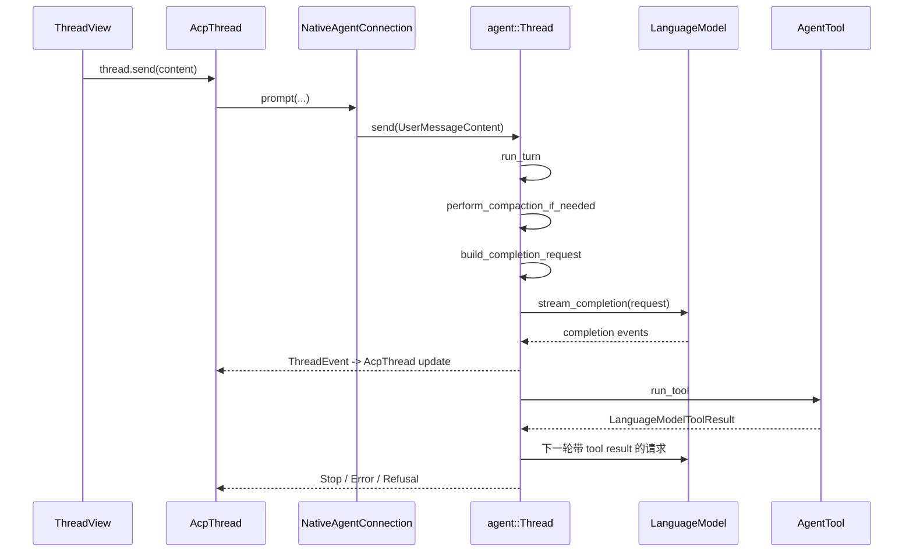

# AI 设计与实现分析

本文分析当前 Zed 仓库中 AI 功能的客户端设计与实现。这里的 AI 不只指
Agent Panel，而是包含模型访问层、原生 Zed Agent、外部 ACP Agent、Inline
Assistant、Terminal Assistant、Edit Prediction、工具权限、沙箱、skills、MCP
prompt 和相关设置。

本文只写已在当前代码中核对过的事实。provider 具体 HTTP payload、每个工具的
完整业务逻辑、每个外部 agent 的协议适配细节，不在未核对源码的前提下写成确定
结论；做这类改动时应继续追对应 provider crate、tool 模块或 ACP server 适配模块。

## 依据文件

启动与装配：

- `crates/zed/src/main.rs`
- `crates/zed/src/zed.rs`
- `crates/agent_ui/src/agent_ui.rs`
- `crates/agent_ui/src/agent_panel.rs`
- `crates/agent_servers/src/agent_servers.rs`

模型访问：

- `crates/language_model/src/language_model.rs`
- `crates/language_model/src/registry.rs`
- `crates/language_model/src/request.rs`
- `crates/language_model_core/src/language_model_core.rs`
- `crates/language_model_core/src/request.rs`
- `crates/language_models/src/language_models.rs`

原生 Agent：

- `crates/agent/src/native_agent_server.rs`
- `crates/agent/src/agent.rs`
- `crates/agent/src/thread.rs`
- `crates/agent/src/tools.rs`
- `crates/agent/src/tool_permissions.rs`
- `crates/agent/src/sandboxing.rs`
- `crates/agent/src/templates.rs`
- `crates/agent/src/templates/system_prompt.hbs`

ACP 与 Agent UI：

- `crates/acp_thread/src/connection.rs`
- `crates/acp_thread/src/acp_thread.rs`
- `crates/agent_ui/src/conversation_view.rs`
- `crates/agent_ui/src/conversation_view/thread_view.rs`
- `crates/agent_ui/src/conversation_view/message_queue.rs`
- `crates/agent_ui/src/message_editor.rs`

Inline、Terminal 与 Edit Prediction：

- `crates/agent_ui/src/inline_assistant.rs`
- `crates/agent_ui/src/buffer_codegen.rs`
- `crates/agent_ui/src/terminal_codegen.rs`
- `crates/zed/src/zed/edit_prediction_registry.rs`
- `crates/edit_prediction/src/edit_prediction.rs`
- `crates/edit_prediction_ui/src/edit_prediction_ui.rs`

设置、prompt 与上下文：

- `crates/agent_settings/src/agent_settings.rs`
- `crates/agent_settings/src/agent_profile.rs`
- `crates/prompt_store/src/prompts.rs`
- `crates/prompt_store/src/prompt_store.rs`

## 总体结构

Zed 的 AI 客户端是多层组合，不是单个“AI 模块”。

关键边界：

- `LanguageModelRegistry` 只管理 provider、模型选择、fallback 和配置状态，不直接
  管 Agent 会话。
- `agent::Thread` 是原生 Zed Agent 的运行循环，负责构造模型请求、接收流式事件、
  执行工具和压缩上下文。
- `AcpThread` 是 UI 和 ACP 协议层可观察的线程状态，保存消息、工具调用、权限请求、
  token usage、terminal 输出等展示状态。
- `ConversationView` 和 `ThreadView` 把 `AcpThread` 渲染成 Agent Panel 中的会话
  UI，并处理输入、队列、认证、错误和通知。
- 外部 agent 通过 `AgentServer` / `AgentConnection` 接入；原生 Zed Agent 也实现同
  一层接口，所以 UI 不需要为原生和外部 agent 分叉大部分逻辑。
- Inline Assistant、Terminal Assistant 和 Edit Prediction 不复用 `agent::Thread`
  的 turn loop；它们直接使用模型或独立的 edit prediction store。

## 启动与开关

AI 初始化分散在 `crates/zed/src/main.rs` 和 `agent_ui::init` 中。

`main.rs` 的 AI 相关启动顺序包括：

1. 初始化 `language_model::init`，创建全局模型注册表。
2. 注册 LLM token refresh listener。
3. 调用 `language_models::init` 注册内置和兼容 provider。
4. 初始化 `acp_tools`、web search、edit prediction registry、prompt builder。
5. 初始化全局 `AgentRegistryStore`。
6. 调用 `agent_ui::init(...)`，注册 Agent UI、Inline Assistant、Terminal Assistant
   和 metadata store。
7. 注册 user agents md watcher。

`agent_ui::init` 内部继续做几件事：

- 初始化全局 `agent::ThreadStore`。
- 初始化 `prompt_store`。
- 安装 `agent_skills::SkillsUpdatedHook`，skills 更新时刷新所有 workspace 的
  Agent Panel。
- 非 eval 场景下从用户设置初始化 language model 选择。
- 调用 `agent_panel::init` 注册 Agent Panel actions。
- 初始化 context server 配置界面、thread metadata store、terminal thread metadata
  store。
- 初始化 `inline_assistant` 与 `terminal_inline_assistant`。
- 注册 agent registry 页面 action。

AI 有多层开关：

- `DisableAiSettings.disable_ai` 是总开关。`zed.rs` 中
  `setup_or_teardown_ai_panel` 会在 AI 禁用或测试环境下移除 Agent Panel；启用时异步
  加载并添加 panel。
- `AgentSettings.enabled(cx)` 还会检查 `DisableAiSettings`，用于隐藏/显示 agent
  相关 UI 能力。
- `AllLanguageSettings.edit_predictions.provider` 控制 Edit Prediction provider。命令
  面板过滤逻辑会根据 provider 隐藏或显示 edit prediction / copilot action。
- Inline Assistant 在观察到 AI 禁用时会取消活动补全。

这意味着二次开发不能假定 Agent Panel、Inline Assistant 和 Edit Prediction 总是可用。
例如 deep link 打开 Agent Panel 时，`main.rs` 会先等待 workspace panels 加载，再尝试
focus `AgentPanel`；如果 panel 因禁用 AI 不存在，只记录 warning。

## 模型访问层

模型抽象在 `language_model` 和 `language_model_core` 中。

`LanguageModel` trait 描述一个具体模型实例，包含：

- provider id、model id、显示名、telemetry id。
- 是否支持 thinking、关闭 thinking、fast mode、effort level、server-side
  compaction、图片、工具、tool choice、streaming tool input 等能力。
- token 限制、输出 token 限制、成本估算、API key 名称、data retention 要求。
- `stream_completion(...)`，返回 `LanguageModelCompletionEvent` 流。

`LanguageModelCompletionEvent` 是所有模型流式输出的统一事件，包括：

- 队列/开始/停止事件。
- 文本、thinking、redacted thinking、reasoning details。
- tool use、tool JSON parse error。
- token usage 更新。
- compaction 事件。

`LanguageModelRequest` 由 core request 类型组成。消息内容可以是文本、thinking、图片、
tool use、tool result 和 compaction。tool result 支持文本和图片；图片会在
`language_model/src/request.rs` 中按 provider 能力和大小限制转为 base64 PNG。

`LanguageModelProvider` trait 描述 provider：

- provider id、名称、图标。
- 默认模型、fast 默认模型、推荐模型、可提供模型列表。
- 认证状态、配置视图、清理 credentials、认证错误文案。
- v2 配置展示、fast mode 确认信息等。

`LanguageModelRegistry` 是全局模型注册中心。它保存：

- 默认模型、fallback 模型。
- inline assistant、commit message、thread summary 的模型选择。
- provider map、inline alternative models。
- 已安装扩展 provider id，以及 provider 隐藏函数。

`language_models::init` 注册内置 provider，包括 Zed cloud、Anthropic、OpenAI、
Ollama、LM Studio、Llama.cpp、DeepSeek、Google、Mistral、Bedrock、OpenRouter、
Vercel AI Gateway、xAI、OpenCode、Copilot Chat、OpenAI subscribed provider 等。
它还监听 extension store：当扩展声明同名 language model provider 时，可以隐藏内置
provider。兼容 provider 从 settings 中读取，`openai_compatible` 与
`anthropic_compatible` 发生冲突时，OpenAI-compatible 优先。

fallback 模型选择在 `update_environment_fallback_model` 中处理：优先使用已认证的
Zed cloud provider；如果云端 provider 已认证但模型还没加载完成，不立刻切到其他
provider，以避免 UI 闪烁。否则选择第一个已认证 provider 的默认或推荐模型。

## Agent Server 与 ACP 边界

Agent UI 使用 `Agent` 枚举区分原生和外部 agent：

- `NativeAgent` 的 id 是 Zed Agent。
- `Custom { id }` 代表外部 agent。
- 测试构建里还有 `Stub`。

`Agent::server(...)` 把枚举映射为 `AgentServer`：

- 原生 agent 创建 `agent::NativeAgentServer`。
- 外部 agent 创建 `agent_servers::CustomAgentServer`。

`AgentServer` trait 负责连接 agent server，返回 `Rc<dyn AgentConnection>`。它还支持
默认 mode、config option、favorite config option 等可选能力。

`AgentConnection` trait 是会话协议边界，主要能力包括：

- 创建、加载、恢复、关闭 session。
- 认证、logout、terminal auth task。
- 发送 prompt、retry、cancel、truncate、set title。
- model selector、session modes、config options、session list。
- telemetry、client user message id 能力。

因此，Agent Panel 不直接知道外部 agent 如何运行，只依赖 `AgentConnection`。
原生 Zed Agent 通过 `NativeAgentConnection` 实现同一接口。

## Agent Panel 与 ConversationView

`AgentPanel` 是 workspace panel，持有：

- workspace/project/fs/language registry。
- `ThreadStore`、`AgentConnectionStore`、`ContextServerRegistry`。
- 当前 base view：agent thread、terminal 或未初始化状态。
- draft thread、retained threads、terminal map。
- 当前选中的 agent、持久化状态、菜单状态和 onboarding 状态。

`AgentPanel::load` 从 key-value store 恢复 panel 状态，包括上次选中的 agent、上次激活
thread、terminal、draft 等。创建新线程时大致路径是：

`ConversationView` 是 agent server 的连接和 thread 容器。它处理：

- loading、load error、connected 三种 server state。
- 连接 agent server。
- 新建、加载或恢复 ACP session。
- 创建 `ThreadView`。
- agent auth required 时显示 provider 配置视图或认证描述。
- 接收 `AcpThreadEvent`，更新 UI、通知、错误、可用命令、token usage、title 等。
- 加载 subagent session。

`ConversationView::new_thread_view` 会从 `AcpThread` 构造 UI 所需对象：

- `EntryViewState`，用于同步并渲染 thread entry。
- `MessageEditor`。
- model selector、mode selector 或 config options view。
- native agent profile selector。
- session capabilities：prompt capabilities、available commands、native skills。
- `ThreadView` 的 list state、队列、错误状态、工具权限 UI 状态等。

## AcpThread 展示状态

`AcpThread` 是 Agent UI 与 ACP 协议层的可观察状态对象。它保存：

- session id、parent session id、work dirs、title。
- `AgentThreadEntry` 列表。
- plan、action log、token usage、cost。
- prompt capabilities、available commands。
- running turn、turn id。
- terminal map、pending terminal output/exit。
- draft prompt、UI scroll position。
- streaming text buffer。

`AcpThreadEvent` 包括状态变化、新 entry、entry 更新、title/token 更新、工具授权请求、
retry、subagent、stop/error/refusal、prompt capability 更新、available commands 更新、
mode/config options 更新等。

原生 Agent 的 `ThreadEvent` 会被 `NativeAgentConnection::handle_thread_events` 转换为
`AcpThread` 操作：

- 用户消息推入 `push_user_content_block`。
- assistant 文本/thinking 推入 assistant content block。
- 工具调用用 `upsert_tool_call` 或 update 更新。
- 工具授权通过 `request_tool_call_authorization` 显示等待确认。
- compaction、retry、subagent、stop 等映射为对应 ACP 展示状态。

`AcpThread` 的工具授权状态有专门的 `ToolCallStatus::WaitingForConfirmation`，保存可选
权限项、oneshot responder 和 authorization kind。UI 选择后，结果再回到 agent 工具
执行侧。

## 原生 Zed Agent

原生 Agent 由 `NativeAgentServer` 暴露给 Agent Panel。`connect` 创建 `Templates`，
再创建 `NativeAgent`，并包装为 `NativeAgentConnection`。

`NativeAgent` 的主要职责：

- 管理项目级 `ProjectState`。
- 管理 session map 和 pending session。
- 管理 `ThreadStore` 与 thread 保存/加载。
- 维护语言模型列表，并把 Zed 的 `LanguageModelRegistry` 映射为 ACP model selector。
- 维护 skills index、project context、context server registry。
- 为原生 thread 添加默认 tools、skill tool、sibling thread host。
- 响应模型注册表事件，刷新 active session 的默认模型和 summary 模型。

`ProjectState` 包含：

- `Project`。
- 当前 `ProjectContext`。
- skills、skill loading issues。
- context server registry。
- project context refresh watch 与维护任务。

`Session` 同时持有两个 thread：

- `thread: Entity<agent::Thread>`，原生执行线程。
- `acp_thread: Entity<AcpThread>`，UI/协议展示线程。

这两个对象在同一个 session 中同步，但职责不同。`register_session` 创建
`AcpThread`，再调用 `thread.add_default_tools(...)` 安装默认工具，并加上 `SkillTool`。
它还订阅 title/token/thread 更新，用于保存 thread 和同步 metadata。

## NativeAgentConnection prompt 路径

`NativeAgentConnection::prompt` 是 UI prompt 进入原生 Agent 的入口。它会先处理 slash
command，再把 ACP content 转为原生 user message。

slash command 解析规则：

- `/compact` 是原生命令，调用 thread compaction。
- MCP prompt 优先于未限定的 skill。
- `/<server>.<prompt>` 用于显式 MCP server prompt。
- `/:name` 或 `/<worktree>:name` 用于 scoped skill。
- 未限定 skill 会按 source precedence 解析。
- 即使 skill 设置了 `disable_model_invocation`，slash command 仍可显式调用。

非 slash prompt 会按 project path style 将 ACP content blocks 转为
`UserMessageContent`，再调用 `thread.send(...)`。

## agent::Thread 运行循环

`agent::Thread` 是原生 Zed Agent 的核心运行时。它保存：

- 模型、summary 模型、thinking/speed/profile 设置。
- 消息历史、pending agent message、running turn。
- request token usage、cumulative token usage。
- project context、context server registry、templates。
- 工具表、action log、subagent context。
- draft prompt、UI scroll position。
- sandbox grants、thread sandbox grants。

发送一条消息的主链路是：

`send` 会追加 `Message::User`，然后进入 `send_existing`。`run_turn` 会取消旧 turn、构建
新的 event stream、计算 enabled tools、创建 cancellation watch，并启动
`run_turn_internal`。

`run_turn_internal` 是 loop：

1. 必要时执行自动 compaction。
2. 每轮重新读取当前模型和工具，允许用户在运行中修改模型或工具配置。
3. 构造 `LanguageModelRequest`。
4. 调用 `model.stream_completion(...)`。
5. 处理流式事件：文本、thinking、tool use、usage、stop 等。
6. 如果 tool input 未完成且工具支持 streaming input，先启动工具并持续传入增量输入。
7. 如果得到 tool result，把结果写入 pending message，再进入下一轮模型请求。
8. 如果没有工具或结果，结束 turn。
9. 如果用户要求在下一个边界停止，则在工具边界结束 turn，用于排队消息 steering。
10. 错误时按 retry strategy 重试；拒答时尝试 provider 内 fallback model。

`handle_completion_event` 把模型事件归并为 thread 事件和内部状态：

- `StartMessage` 会 flush 当前 pending message，再开始新的 agent message。
- `Text` 和 `Thinking` 更新 pending assistant message，并发送 `AgentText` /
  `AgentThinking`。
- `ToolUse` 调用 `handle_tool_use_event`。
- `UsageUpdate` 累积 token usage。
- `Stop` 根据原因返回正常结束、tool use、max token、refusal 等状态。

thread title 和 summary 也是模型请求：

- 首条消息可先在 UI 里设置 provisional title。
- `generate_title` 使用 summary 模型生成标题。
- `summary()` 使用 summary 模型构造详细 summary prompt。
- compaction 会插入 `Message::Compaction`，并把 summary 作为后续请求上下文。

## Prompt、项目上下文与 Skills

项目上下文由 `NativeAgent::build_project_context` 维护。它会收集 visible worktree，
读取 worktree rules，并加载 skills。

rules 文件名来自 `prompt_store/src/prompts.rs`，包括 `.rules`、`.cursorrules`、
`.windsurfrules`、`.clinerules`、`.github/copilot-instructions.md`、`AGENT.md`、
`AGENTS.md`、`CLAUDE.md`、`GEMINI.md`。

skills 加载规则：

- 全局 skills 来自 global skills dir。
- 项目本地 skills 只从 trusted worktree 加载。
- 本地 skills 位于 `.agents/skills/<skill>/SKILL.md`。
- 加载时校验大小、frontmatter 和描述。
- 项目 skills 会覆盖同名 global skills。
- 模型可见 skill catalog 受描述 budget 限制；完整 skills 列表仍用于 autocomplete。
- issues 变化时发出 `SkillLoadingIssuesUpdated`，同时发布全局 `SkillIndex`。

system prompt 模板在 `crates/agent/src/templates/system_prompt.hbs`。模板输入包含：

- `ProjectContext`。
- 可用工具。
- 模型名称。
- 当前日期。
- 用户 AGENTS.md 内容。
- sandboxing 标志。
- Linux / Windows 标志。

`build_request_messages_until` 会先渲染 system prompt，再追加历史消息。发生 compaction
后，会放入 summary compaction message 和需要保留的 user messages。最后一条消息设置
`cache=true`。

## 工具、权限与沙箱

工具抽象在 `agent::thread.rs` 中：

- `AgentTool` 是类型化工具 trait，定义输入/输出 schema、名称、描述、kind、provider
  支持、是否支持 streaming input，以及 `run`。
- `AnyAgentTool` 是 erased wrapper，用于运行时工具表。
- 工具错误也以结构化输出返回模型，因此 `run` 返回
  `Task<Result<Output, Output>>`。

内置工具在 `agent/src/tools.rs` 的 `tools!` 宏中注册。当前列表包括：

- code action、copy path、create directory、delete path、move path、write file、edit
  file、read file。
- diagnostics、find references、get code actions、go to definition、rename。
- grep、find path、list directory。
- fetch、web search、terminal。
- skill、spawn agent、create thread、list agents and models。

`enabled_tools` 会按多重条件过滤：

- 当前模型是否支持该工具所在 provider。
- 当前 profile 是否启用该工具。
- feature flag 是否启用。
- context server tool 是否被 profile 启用。
- terminal 是否启用 sandboxing。启用时暴露 sandboxed terminal under canonical
  `terminal` 名称；否则暴露普通 terminal。
- context server tool 名称冲突时，按 server id 前缀重命名，同时受最大 tool name 长度
  限制。

权限判定在 `tool_permissions.rs` 和 `ToolCallEventStream::authorize*`。判定优先级是：

1. 硬编码安全规则。
2. always deny。
3. always confirm。
4. always allow。
5. 工具默认规则。
6. 全局默认规则。

terminal 有硬编码拒绝规则，覆盖危险的 `rm` 目标，例如 root、home、`$HOME`、当前目录
和父目录。这类规则不能通过设置覆盖。权限结果可以是 allow、deny 或 confirm；confirm
会通过 `AcpThread` 进入 UI 等待用户选择。

沙箱策略集中在 `sandboxing.rs`：

- 只有 feature flag、local project、支持的平台、且没有 persistent
  `allow_unsandboxed` 时才启用。
- macOS 使用 Seatbelt，Linux 使用 Bubblewrap，Windows 通过 WSL Bubblewrap；不支持平台
  则 no-op。
- worktree root 作为可写路径。
- `.git` 和常见 repository 目录有专门保护策略。
- per-command allow once / allow thread 不改变 prompt 或 tool set。
- persistent allow unsandboxed 会暴露普通 terminal，并从 prompt 中移除 sandbox prompt
  section。

工具结果如果包含图片，但模型不支持图片，`run_tool` 会把混合结果中的图片替换为占位
文本；如果只有图片，则返回错误给模型。

## MessageEditor 与发送队列

`MessageEditor` 是 Agent 输入框。它持有：

- mention set。
- 内部 `Editor`。
- workspace weak handle。
- session capabilities。
- agent id。
- 可选 `ThreadStore`。

它不直接调用模型。发送前会调用 `contents(...)`：

1. 读取当前文本。
2. 根据 session capabilities 校验 slash command。
3. 从 mention set 解析 `@` 引用。
4. 根据 crease 和 mention 构造 ACP `ContentBlock`。
5. 根据是否支持 embedded context 决定 inline resource 还是 resource link。

支持的内容包括文本、嵌入资源、资源链接和图片。粘贴外部路径时，如果是图片且 session
支持图片，会转为 image context；如果是本地项目路径，会转为 project path mention。

`ThreadView::send` 是主发送入口：

- 如果正在加载内容，直接返回。
- 如果主输入为空，尝试 fast-track 已排队消息。
- 如果当前 thread 正在生成，则把消息加入 `MessageQueue`。
- `/login` 和 `/logout` 有特殊处理。
- 如果输入以 native command 开头，例如 `/compact`，会先发送裸命令，并把剩余输入排队。
- 否则解析内容并调用 `send_content`。

`send_content` 会：

- 设置 in-flight prompt。
- 记录 action log 中读取过的 buffer。
- 上报 telemetry。
- 对 native command 调用 `AcpThread::send_command`，否则调用 `AcpThread::send`。
- turn 完成后清理 in-flight prompt 或展示错误。

`MessageQueue` 处理生成中的 follow-up：

- `enqueue` 入队并恢复自动处理。
- `try_fast_track` 允许用户在空主输入上回车立即发送队首。
- `on_generation_stopped` 在生成结束后自动发送下一条，除非用户正在编辑队首。
- `send_now` 会在必要时取消当前生成，并吸收取消事件，避免重复发送。
- 队首的 `steer` 会同步到 native thread 的 `end_turn_at_next_boundary`，让 agent 在工具
  边界停下。

## Inline Assistant

Inline Assistant 在 `inline_assistant::init` 中注册为全局对象。它会：

- 观察 settings，AI 禁用时取消活动补全。
- 观察新 workspace，注册 workspace event。
- 同步 Terminal Panel 的 assistant enabled 状态。

触发 inline assist 时：

1. 检查 `AgentSettings::enabled(cx)`。
2. 解析目标是 editor 还是 terminal。
3. 检查 inline assistant model 的配置错误。
4. 对 editor 调用 `assistant.assist(...)`。
5. 对 terminal 走 terminal inline assistant。

Editor inline assist 使用 `BufferCodegen`：

- 每个 assist 对应 buffer 范围和一个 prompt editor。
- `BufferCodegen` 创建一个主 `CodegenAlternative`。
- 如果设置了 inline alternative models，会为每个 alternative model 创建额外
  `CodegenAlternative`。
- `start` 会用 `LanguageModelRegistry::inline_assistant_model()` 作为主模型。
- 模型支持 streaming tools 且设置启用时，走 `stream_completion` 事件流；否则走
  `stream_completion_text`。
- prompt 由 `PromptBuilder` 生成 inline transformation prompt。

Terminal codegen 使用同一个 inline assistant 模型，但写入目标是 terminal：

- `TerminalCodegen::start` 从 `LanguageModelRegistry` 读取 inline assistant model。
- 调用 `stream_completion_text`。
- `TerminalTransaction::push` 会过滤 `\r` 和 `\n`，避免流式生成的命令被意外执行。
- `complete` 发送 carriage return。
- `undo` 发送清空输入控制字符。

这说明 Inline Assistant 更像“编辑器/终端局部代码生成器”，不是 Agent Thread 的子类。

## Edit Prediction

Edit Prediction 是独立子系统，接入 editor 的 edit prediction provider，而不是 Agent
Panel。

`zed/edit_prediction_registry.rs` 启动时：

- 创建全局 `EditPredictionStore`。
- 观察新建 `Editor`，只给 full-mode editor 注册 provider。
- 记录 editor 到 window handle map，便于 settings 或用户信息变化时重新分配 provider。
- 观察 user store 的用户信息和组织变化。
- 观察 settings 中 edit prediction provider 变化，并重新给所有 editor 分配 provider。

provider 设置映射：

- `None`：清空 edit prediction provider。
- `Copilot`：通过 `EditPredictionStore` 启动项目 Copilot，注册 buffer，设置
  `CopilotEditPredictionDelegate`。
- `Codestral`：加载 API key，设置 `CodestralEditPredictionDelegate`。
- `Zed`：设置 `EditPredictionModel::Zeta`，注册 buffer，设置
  `ZedEditPredictionDelegate`。
- `Ollama` / `OpenAiCompatibleApi`：读取自定义配置并推断 prompt format。Zeta format 走
  `EditPredictionModel::Zeta`，否则走 `EditPredictionModel::Fim { format }`。
- `Mercury`：走 `EditPredictionModel::Mercury`。

`EditPredictionStore` 保存：

- client、user store、LLM token。
- project state、edit prediction model。
- zeta raw config、request backoff、experiments。
- Mercury 客户端状态。
- rejected/settled prediction worker。
- rateable/rated predictions。
- credentials provider。

请求预测时，`request_prediction_internal` 会：

1. 判断是否是 cloud Zeta；无 cloud credentials 时直接返回空结果。
2. 检查超时 backoff。
3. 读取项目 edit events、prompt history boundary、debug channel。
4. 获取当前 buffer snapshot 和 cursor 附近诊断搜索范围。
5. 加载 related files。
6. 根据 feature flag 决定是否允许 jump prediction。
7. 根据语言设置选择 eager/subtle 模式。
8. 读取 git repository URL 和 revision。
9. 判断是否允许数据采集：非测试、开源、用户允许、且模型是 Zeta。
10. 构造 `EditPredictionModelInput`。
11. 根据模型分派到 `zeta::request_prediction_with_zeta`、
    `fim::request_prediction` 或 `mercury.request_prediction`。

`queue_prediction_refresh` 还实现节流和并发控制：Zed/Mercury 最多 pending 2，Ollama
最多 pending 1，OpenAI-compatible 最多 pending 2。对不通过 `EditPredictionStore` 的
provider 调用该路径会记录错误。

## 设置与 Profile

`AgentSettings` 是 AI 客户端行为的主要设置入口，包含：

- Agent 是否启用、按钮、dock/flexible/sidebar 布局和默认尺寸。
- 默认模型、subagent 模型、inline assistant 模型、commit message 模型、thread summary
  模型、inline alternative models、favorite models。
- 默认 profile 和 profile map。
- 通知、声音、review、feedback、终端初始化、thinking 展示、取消策略。
- message editor 行数、turn stats、merge conflict indicator。
- tool permissions、sandbox permissions。
- auto compact 阈值。
- per-model parameters，例如 temperature。

`AgentProfile` 定义工具和 context server 能力边界。内置 profile 包括 write、ask、
minimal。profile 可以：

- 设置工具 enable map。
- 设置是否启用全部 context servers。
- 对单个 context server 设置 preset。
- 设置默认模型。

`Thread::enabled_tools` 会读取当前 profile，所以新增工具后只注册 tool trait 不够，还要
同步默认 settings、设置 UI、feature flag 和 profile 行为。

## 数据持久化

AI 客户端涉及多类本地持久化：

- `AgentPanel` 把选中 agent、最后活跃 thread/terminal、draft thread 等写入 key-value
  store。
- `NativeAgent` 在 session 关闭或 app 退出时保存非空 thread，保存内容包括原生
  `Thread` 序列化、folder paths、draft prompt、UI scroll position 等。
- `ThreadMetadataStore` 和 terminal thread metadata store 存储 UI 所需 metadata。
- `PromptStore` 使用 LMDB 存储 prompt library，并插入未自定义的内置 prompt。
- Edit Prediction 维护项目级 edit history、rejected/settled prediction worker 和
  feedback 提交状态。

这些持久化分属不同边界。改 Agent Panel 布局恢复，不应直接改原生 thread 数据结构；
改 thread 保存/恢复，应从 `NativeAgent::save_thread`、`thread_save_payload` 和
`Thread::to_db` 继续追。

## 二次开发入口

| 目标                  | 主要入口                                                                 | 注意事项                                               |
| --------------------- | ------------------------------------------------------------------------ | ------------------------------------------------------ |
| 增加模型 provider     | `language_models::init`、`LanguageModelProvider`、provider crate         | 处理认证、推荐模型、fallback、扩展 provider 隐藏。     |
| 调整默认模型选择      | `LanguageModelRegistry`、`AgentSettings`、`language_models` fallback     | 区分默认、inline、commit、thread summary 模型。        |
| 增加 Agent 工具       | `agent/src/tools.rs`、具体 tool 模块、profile/settings UI                | 同步权限、feature flag、schema、provider 支持。        |
| 改工具权限            | `tool_permissions.rs`、`ToolCallEventStream::authorize*`                 | 硬编码安全规则优先，不能被 settings 覆盖。             |
| 改 terminal 沙箱      | `sandboxing.rs`、terminal tool、sandbox prompt                           | 区分 persistent unsandboxed 和 per-command grant。     |
| 改 Agent 运行循环     | `agent/src/thread.rs`                                                    | 影响 retry、compaction、tool loop、取消和 token。      |
| 改 Agent UI           | `agent_panel.rs`、`conversation_view.rs`、`thread_view.rs`               | 注意 `AcpThread` 与 `agent::Thread` 的边界。           |
| 改输入框/mention      | `message_editor.rs`、`mention_set`、completion provider                  | 需要维护 ACP content block 与 tracked buffer 语义。    |
| 接入外部 Agent        | `agent_servers`、`AgentServerStore`、`AgentConnection`                   | 外部 agent 在 shared collab project 中目前有限制。     |
| 改 Inline Assistant   | `inline_assistant.rs`、`buffer_codegen.rs`、prompt builder               | 不经过 Agent Thread，直接使用 inline assistant model。 |
| 改 Terminal Assistant | `terminal_codegen.rs`、terminal inline assistant                         | 流式文本会去掉换行，避免意外执行。                     |
| 改 Edit Prediction    | `edit_prediction_registry.rs`、`edit_prediction`、editor edit prediction | provider delegate 与 Agent model registry 是不同边界。 |
| 改 skills             | `NativeAgent::build_project_context`、`agent_skills`、`SkillIndex`       | 只加载 trusted worktree 本地 skills，且有预算裁剪。    |
| 改 system prompt      | `templates/system_prompt.hbs`、`templates.rs`、`ProjectContext`          | 模板输入来自项目上下文、工具、日期、sandbox、平台。    |

## 风险点

- AI 总开关会移除 Agent Panel 并隐藏命令，改 action 或 deep link 时要处理 panel 不存在。
- 原生 Agent 有两个 thread 对象：`agent::Thread` 管执行，`AcpThread` 管展示。混淆这两个
  层会导致状态、持久化或 UI 更新位置错误。
- 工具结果会继续喂回模型，工具错误也可能是模型可读的结构化输出，不应简单当成 UI 错误。
- 自动 compaction、refusal fallback、retry、message queue steering 都在运行循环里影响
  turn 边界，改动时要验证多轮工具调用和取消场景。
- Edit Prediction 不走 Agent Thread；它依赖 editor provider、project edit history 和
  独立请求节流。
- provider 认证、Zed-hosted models、subscriptions 和 cloud edit prediction 涉及线上服务
  边界，当前仓库不包含完整 zed.dev 后端。
